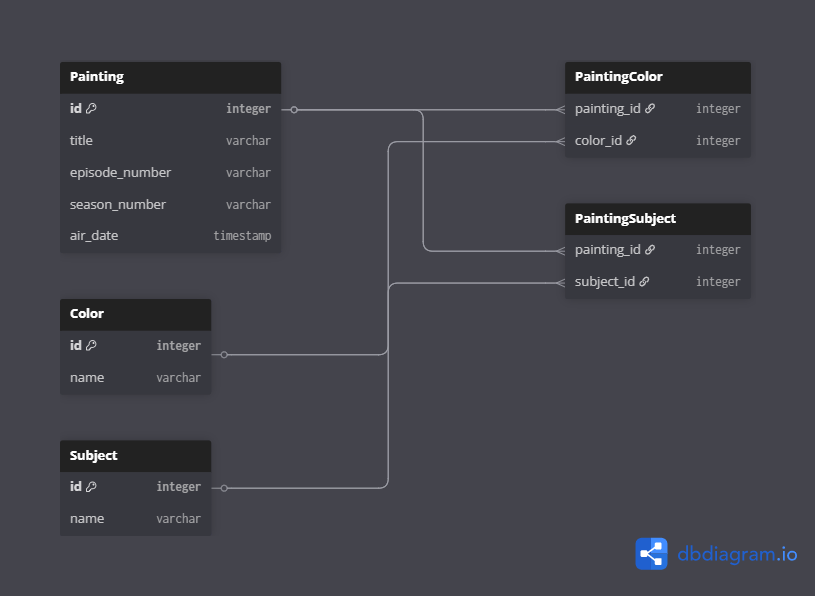

# 🎨 The Joy of Painting API

This project explores the ETL (Extract, Transform, Load) process by organizing episode data from *The Joy of Painting* with Bob Ross. It transforms messy datasets into a structured SQL database and exposes the data via an API with filter support.

---

## 📌 Objective

- **Extract**: Load data from various formats (CSV, JSON)  
- **Transform**: Clean and normalize the data  
- **Load**: Store it in a structured SQL database  
- **Serve**: Build an API to allow filtering episodes by:
  - Month of original broadcast
  - Subject matter (e.g., mountain, lake)
  - Color palette (e.g., phthalo blue, titanium white)

---

## 🗂 Database Schema

The data is structured using a normalized relational schema to support many-to-many relationships between paintings, colors, and subjects.

📄 **View Schema Diagram**:  


---

## ⚙️ Database Setup & ETL Process

To create the database and load data locally:

bash
# PostgreSQL example
createdb bob_ross
psql -d bob_ross -f schema/schema.sql

# Load cleaned data into the database using ETL script
python etl/load_data.py
The ETL scripts handle all CSV/JSON parsing, normalization, and database insertion.
Includes error handling for missing or inconsistent data.

🚀 API Usage
After loading data, start the API server:

bash
Copy code
python app.py
Example Endpoints:

http
Copy code
GET /episodes?month=January      # List episodes aired in January
GET /episodes?subject=mountain   # Filter episodes with mountains
GET /episodes?color=phthalo blue # Filter episodes by color palette

🔧 Tech Stack
<p>           </p>
💡 Challenges & Lessons Learned
Cleaning inconsistent data across multiple sources

Designing a normalized relational database for many-to-many relationships

Building a RESTful API for dynamic filtering

Efficiently handling large datasets in Python

📸 Screenshots / Demo
### Postman API Test


👤 About Me
Hi, I’m Malik Vance, a Fullstack Software Engineer passionate about bridging the gap between hardware and software.

LinkedIn
👤 **Connect with Me**  
[LinkedIn Profile](https://www.linkedin.com/in/malik-vance)

☕ Support Me
<a href="https://www.buymeacoffee.com/SpaceDandy15" target="_blank">  </a> ```
